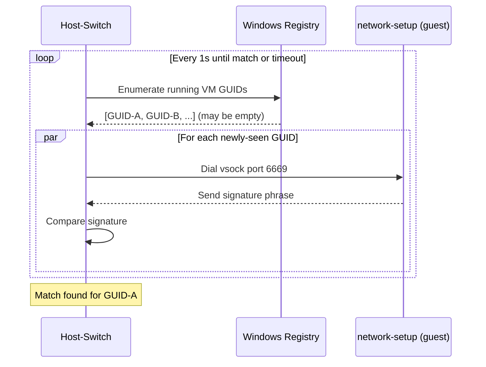
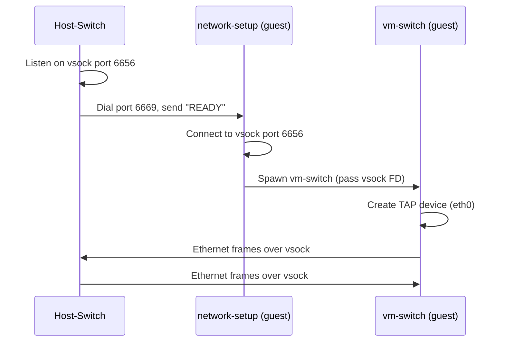
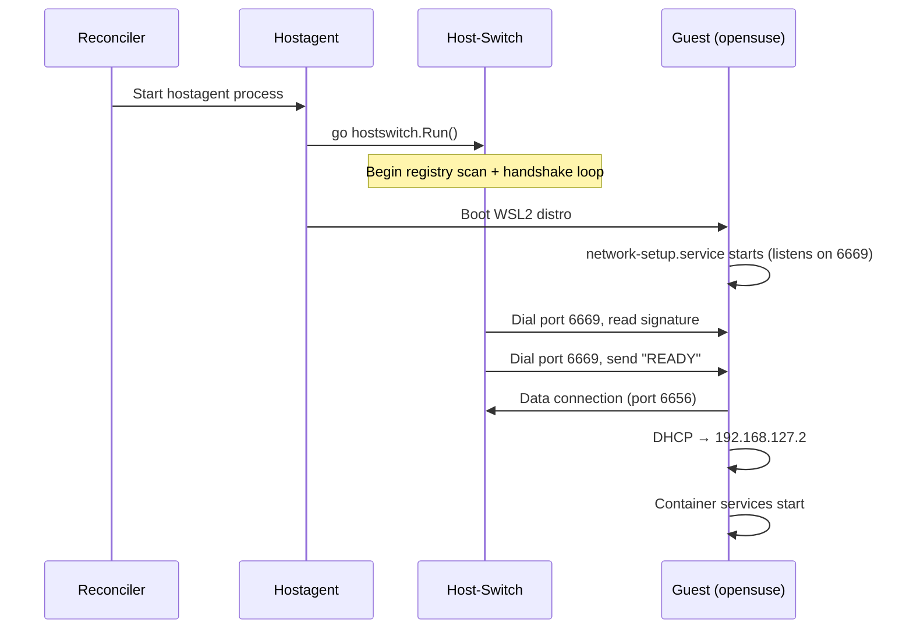
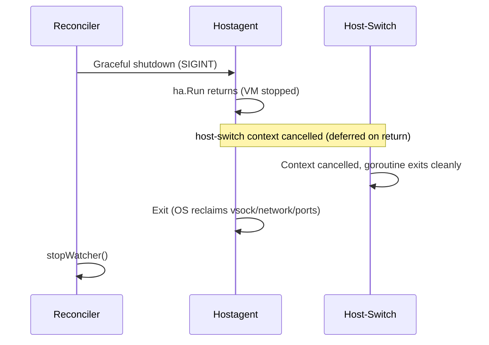

# WSL2 Networking

WSL2 VMs run inside a Hyper-V lightweight utility VM that lacks a direct network bridge to the Windows host. The opensuse distro uses a virtual L2 network over AF_VSOCK to provide DNS, DHCP, and NAT between the guest and the host.

## Architecture

The hostagent process runs a host-switch goroutine for each WSL2 instance. Because the host-switch lives inside the per-VM hostagent (rather than the long-lived controller), the OS reclaims all of its host resources — vsock listeners, the gvisor virtual network, and any exposed host ports — automatically when the hostagent exits with the VM. The guest-side binaries (`network-setup`, `vm-switch`) are baked into the opensuse distro image.

```
Windows Host (hostagent process)              WSL2 VM (opensuse distro)
────────────────────────                      ────────────────────────
host-switch goroutine                         Default namespace
├─ vsock handshake (port 6669) ◄────────────► ├─ network-setup
├─ vsock listener (port 6656)  ◄────────────► │  └─ vsock dial (port 6656)
├─ gvisor-tap-vsock virtual network           │
│  ├─ DNS (*.rancher-desktop.internal)        Isolated network namespace
│  ├─ DHCP (192.168.127.2)                    ├─ vm-switch
│  ├─ NAT (.254 → 127.0.0.1)                 │  ├─ TAP eth0 (192.168.127.2)
│  └─ HTTP API (:80)                          │  └─ udhcpc → DHCP from host
└─ OS syscalls (egress)                       ├─ veth-rd-ns (192.168.143.1)
                                              └─ containers, k3s, etc.
```

### Virtual Network Topology

The virtual network uses the `192.168.127.0/24` subnet:

| Address | Role |
|---------|------|
| `192.168.127.1` | Gateway (host-switch) |
| `192.168.127.2` | TAP device (guest, assigned via DHCP static lease) |
| `192.168.127.254` | Static DNS host (NAT to `127.0.0.1` on host) |

The guest resolves `gateway.rancher-desktop.internal` and `host.rancher-desktop.internal` via DNS zones served by gvisor-tap-vsock.

A veth pair bridges the default WSL namespace (`veth-rd-wsl`, `192.168.143.2`) and the isolated network namespace (`veth-rd-ns`, `192.168.143.1`). All container services run inside the isolated namespace.

## Vsock Handshake Protocol

The host and guest discover each other through a two-phase handshake over AF_VSOCK.

### Phase 1: VM Discovery (port 6669)

Multiple Hyper-V VMs may be running. The host-switch identifies the correct one by exchanging a signature phrase.



The registry is rescanned every second because the host-switch starts concurrently with the hostagent booting the WSL2 VM. On a fresh system where no other WSL2 distro is running, the utility VM may not yet appear in the registry when the first scan runs.

The signature phrase is `"github.com/rancher-sandbox/rancher-desktop/src/go/networking"`. This is a fixed protocol constant shared between host-switch and the guest's `network-setup` binary. Because the signature is product-wide rather than per-instance, this discovery assumes only one opensuse WSL2 instance runs at a time.

### Phase 2: Data Channel (port 6656)

After identifying the VM, the host-switch creates a listener and signals readiness.



Ethernet frames use a simple framing protocol: a 2-byte little-endian size prefix followed by the raw frame payload.

## Virtual Network Services

The host-switch creates a [gvisor-tap-vsock](https://github.com/containers/gvisor-tap-vsock) virtual network that provides:

- **DNS**: Resolves `*.rancher-desktop.internal` and `*.docker.internal` zones. Forwards all other queries to the host's DNS resolver.
- **DHCP**: Assigns `192.168.127.2` to the guest's TAP device via a static lease keyed on MAC address `5a:94:ef:e4:0c:ee`.
- **NAT**: Maps `192.168.127.254` to `127.0.0.1`, allowing the guest to reach services bound to localhost on the Windows host.
- **HTTP API**: Listens on `192.168.127.1:80` with endpoints for dynamic port forwarding (`/services/forwarder/expose`, `/services/forwarder/unexpose`, `/services/forwarder/all`).

## Lifecycle Integration

The host-switch goroutine runs inside the hostagent process, so it shares the VM's lifecycle exactly. The hostagent launches it as soon as it starts (concurrently with booting the VM — the guest blocks on the vsock handshake during boot, and the host-switch polls the registry until the VM appears) and it stops when the hostagent process exits. Because the goroutine dies with the process, the OS reclaims every host resource it held; there is no separate teardown step in the reconciler.

### Normal Start



### Normal Stop



### Bridge Failure Recovery

If the bridge's setup or its vsock listener fails while the VM keeps running — for example the AF_VSOCK listener that accepts the guest's data connections drops — `runOnce` returns and `hostswitch.Run` restarts the bridge internally, rate-limited to one attempt per 15 seconds. The VM and hostagent keep running; the reconciler is not involved.

A wedged *data plane* behind a still-live listener is a different failure and is **not** auto-restarted. The accept loop keeps running, because a relay that stalls while the listener still accepts connections is typically a guest-side `vm-switch` problem that restarting the host bridge cannot fix. Instead of looping the bridge, host-switch escalates once at error level with byte-counter diagnostics when data connections keep closing within seconds, pointing at the guest; recovery there is operator- or guest-driven.

### Crash Recovery

If the hostagent crashes, its host-switch goroutine dies with it and the OS reclaims the host resources. The watcher detects the exit and triggers a reconcile; the reconciler relaunches the hostagent, which starts a fresh host-switch.

```mermaid
sequenceDiagram
    participant R as Reconciler
    participant W as Watcher
    participant HA as Hostagent

    HA->>HA: Crash (host-switch dies with it; OS reclaims resources)
    W->>R: Enqueue reconcile (phase=Stopped)
    R->>W: stopWatcher()
    R->>HA: Start new hostagent (starts fresh host-switch)
    Note over HA: New handshake cycle
```

### Control Plane Restart

When the control plane restarts, the hostagent (and its host-switch) keeps running as an orphan. The reconciler detects the orphaned hostagent and kills it so it can start fresh with a watcher; killing the process also tears down its host-switch via OS cleanup.

### Graceful Shutdown

The `shutdownAllHostagents` runnable signals each hostagent to exit. The host-switch stops as part of the hostagent process exiting — the OS reclaims its resources without a separate teardown.

## Implementation

### Guest-side binaries (in opensuse distro image)

| Binary | Systemd unit | Purpose |
|--------|-------------|---------|
| `network-setup` | `network-setup.service` | Vsock handshake, namespace setup, spawns vm-switch |
| `vm-switch` | (child of network-setup) | TAP device, Ethernet frame relay, DHCP client |
| `wsl-proxy` | (future) | Dynamic port forwarding from guest agent |

### Dependencies

The host-switch uses [gvisor-tap-vsock](https://github.com/containers/gvisor-tap-vsock) for the virtual network stack and [go-winio](https://github.com/microsoft/go-winio) / [virtsock](https://github.com/linuxkit/virtsock) for AF_VSOCK on Windows. All three are direct dependencies; they were previously pulled in transitively via Lima.

## Future Work

- **Kubernetes port forwarding**: Pre-forward `127.0.0.1:<App.Status.KubernetesPort>` to the VM's k3s API server so `kubectl` on the host reaches the K8s API inside the VM. The port is allocated dynamically at `7441 + instance.Index()` and stored in `App.Status.KubernetesPort`.
- **Dynamic port forwarding**: Run `wsl-proxy` in the guest to relay container port mappings from the guest agent to the host-switch's HTTP API.
- **DNS search domains**: Read Windows DNS search domains and pass them to gvisor-tap-vsock's DHCP configuration.
